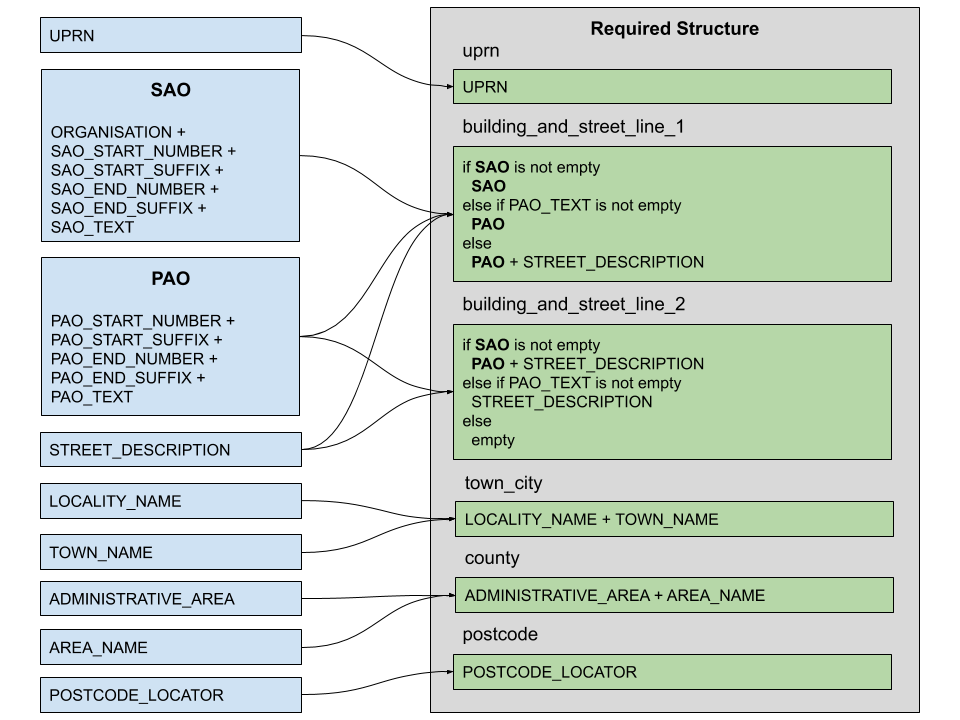

# The address lookup process

The address lookup process consists of 4 main parts:

  1. The user enters a postcode. The Ordnance Survey (OS) Places API is then called and a number of addresses with that postcode are returned.  These are then displayed to the user in a dropdown.

  2. The user selects an address from the dropdown. This captures the entire address object, including the Unique Property Reference Number (UPRN). The address is then converted from the format as presented by the API into the required one.

  3. The user can then edit the address.

  4. The user submits the address to be stored.

There are two points in the process when the user can choose to opt-out of selecting an address by clicking a link, they are then presented with a form into which they can enter their address manually.  This link is shown:

  1. if no results are returned for the entered postcode, and

  2. at the same time as the dropdown, so that the user can click it in cases where the desired address is not present in the dropdown.

Where an address is manually entered, the UPRN is not captured.  So, will be empty in the final stored data.

## Conversion

As the data structure returned by the OS Places API and the one required internally differ significantly, conversion is required between the two.  The following diagram describes the conversion logic.

<strong>Address conversion</strong>

## Primary and Secondary address objects

The OS Places API contains two blocks of sub-address elements: one set beginning `PAO_` and the other set beginning `SAO_`.  These identify the Primary Address Object (PAO) and the Secondary Address Object (SAO). All of these fields are optional for an address.

Internally, we concatenate the individual elements into 2 fields for comparison purposes. The SAO block is additionally concatenated with the `ORGANISATION` field.

## Comparison

As the user is allowed to edit the address prior to submission, it is desirable to maintain the UPRN irrespective of the changes made by the user. So, it is removed only when it is absolutely necessary to do so, i.e. we can no longer trust that the address as entered still matches the address associated with that UPRN. In order to do this, we need to compare the known - i.e. selected from the dropdown - address with the results of the users edit.  Only if the two are still identifiable as being the same address do we retain the UPRN.
